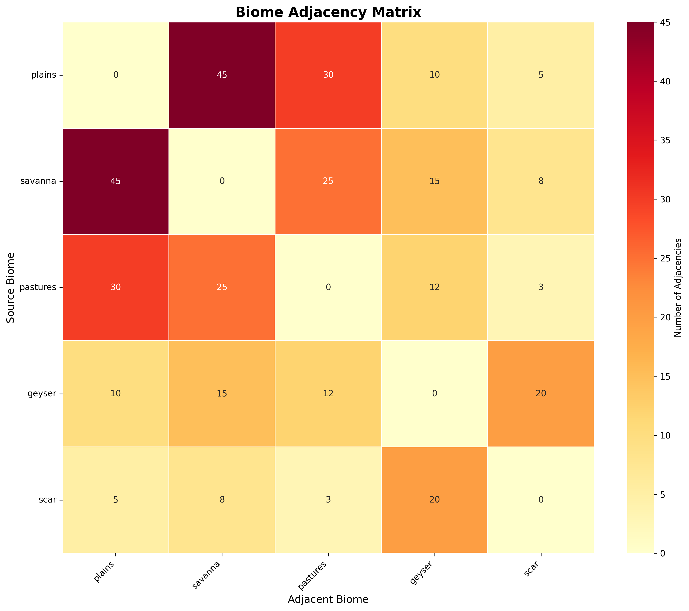
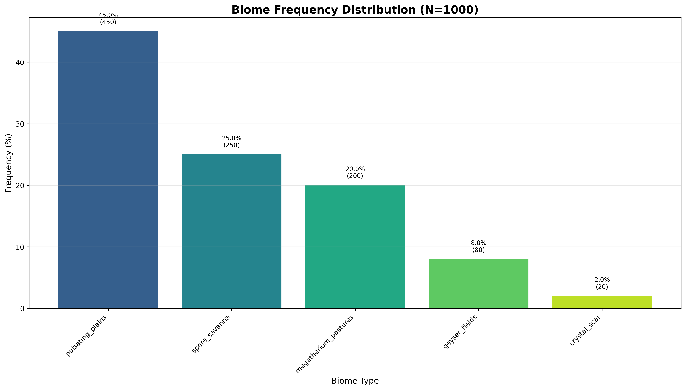
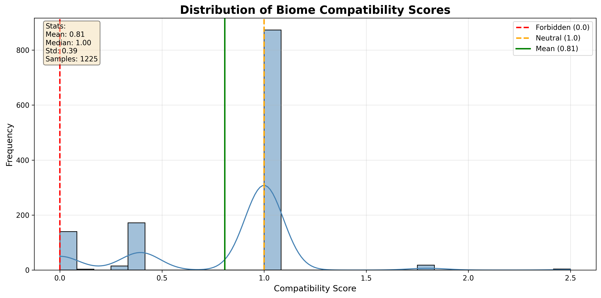
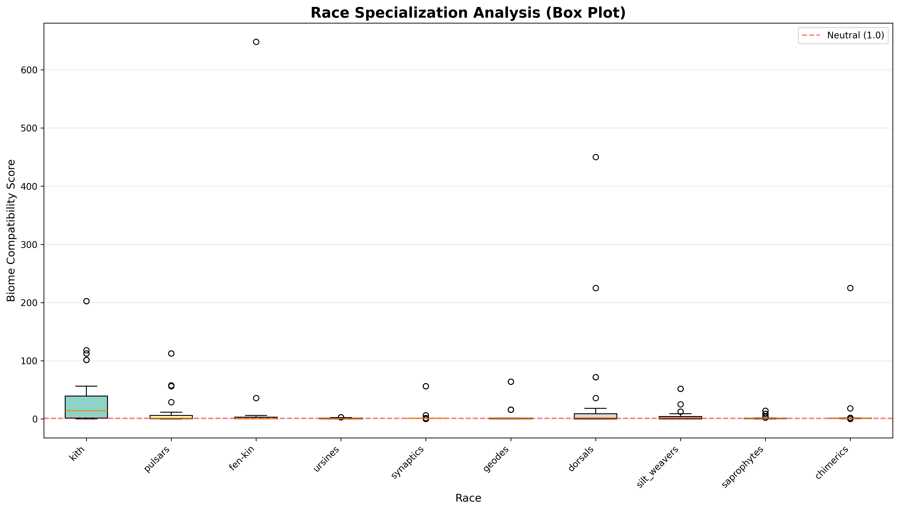
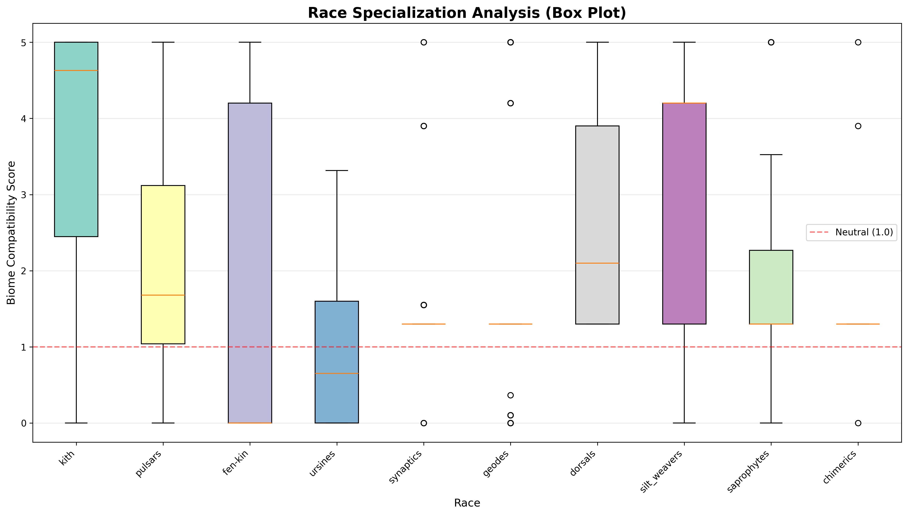

# Comparison: test_baseline vs after_full_conversion

**Date:** 2025-10-15T18:07:38.947799

## Snapshot 1: test_baseline
- Created: 2025-10-15T17:53:00.385923
- Graphs: 4

## Snapshot 2: after_full_conversion
- Created: 2025-10-15T18:07:21.934916
- Graphs: 4

## Graphs to Compare

### adjacency_matrix

**Before:**

**After:**

---

### biome_frequency

**Before:**

**After:**

---

### compatibility_distribution

**Before:**

**After:**

---

### race_specialization

**Before:**

**After:**

---

