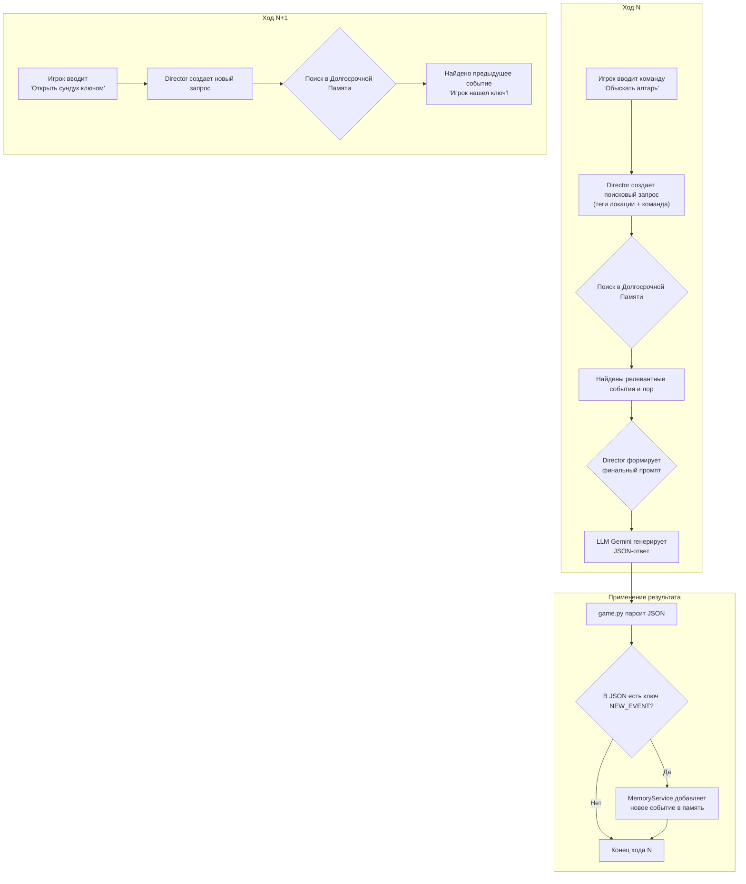

```mermaid
graph TD
    subgraph "Ход N"
        A[Игрок вводит команду<br/>'Обыскать алтарь'] --> B;
        B["Director создает поисковый запрос<br/>(теги локации + команда)"] --> C;
        C{Поиск в Долгосрочной Памяти};
        C --> D[Найдены релевантные события и лор];
        D --> E{Director формирует<br/>финальный промпт};
        E --> F[LLM Gemini генерирует<br/>JSON-ответ];
    end
    
    subgraph "Применение результата"
        F --> G["game.py парсит JSON"];
        G --> H{"В JSON есть ключ NEW_EVENT?"};
        H -- Да --> I[MemoryService добавляет<br/>новое событие в память];
        H -- Нет --> J[Конец хода N];
        I --> J;
    end

    subgraph "Ход N+1"
        K[Игрок вводит<br/>'Открыть сундук ключом'] --> L;
        L["Director создает новый запрос"] --> M;
        M{Поиск в Долгосрочной Памяти};
        M --> N[Найдено предыдущее событие<br/>'Игрок нашел ключ'!];
    end
```